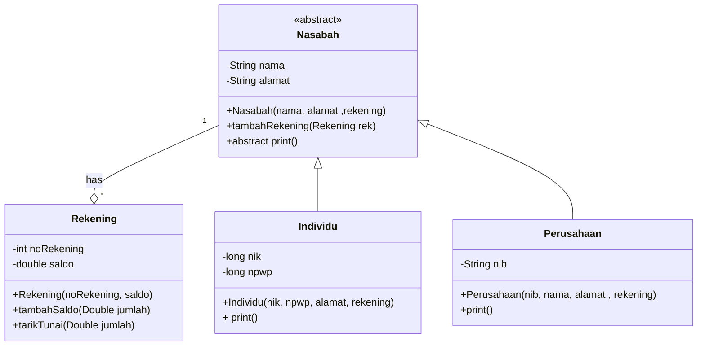

# TUGAS AKHIR PROJEK JAVAFX DENGAN DATA BASE
## KElAS B ANGAKATAN 2020
### ANGGOTA KELOMPOK 2 DAN PEMBAGIAN TUGASNYA:
* YOGI ANDARU
* 2017051062
* * TASK
* * * Class DataModel
* * * Class KoperasiController
* * * Class DBHelper
* * * Data Base sqlite dan mysql
* NESA DWI CAHYANI
* 2017051009
* * TASK
* * * Class Nasabah
* * * Class Individu
* * * Class Perusahaan
* * * Readme.md
* IRMA AZIZAH 
* 2017051038
* * TASK
* * * Class Rekening
* * * Class KoperasiSimpanPinjam
* * * Class Koperasi.fxml
#

## CLASS STRUCTURE
> Agar dapat melihat class diagram di bawah terlebih dahulu download [`MERMAID`](https://www.google.com/url?sa=t&rct=j&q=&esrc=s&source=web&cd=&cad=rja&uact=8&ved=2ahUKEwiI0pbxo__yAhUDSX0KHRo9CSgQFnoECAMQAQ&url=https%3A%2F%2Fchrome.google.com%2Fwebstore%2Fdetail%2Fmermaid-diagrams%2Fphfcghedmopjadpojhmmaffjmfiakfil&usg=AOvVaw3XUo81gMc0iadYNU_ZxFRU) extension pada browser.

## DESKRIPSI PROGRAM
> Program ini dapat digunakan untuk melakukan 
 transaksi tarik tunai, tambah saldo, pendaftaran rekening, penambahan rekening, perekaman atau penyimpanan data 
 pemegang akun di suatu Koperasi Simpan Pinjam, 
 dimana terdapat 2 jenis akun yaitu akun 
 individu dan akun perusahaan. Setiap Pemegang 
 Akun dapat memiliki 1 akun atau lebih. 
#
### Program ini di rancang dengan berbagai tools, yaitu : 
* *  Netbeans 8.0.2
* *  Java 8 Oracle
* *  sqlite
* *  sqlite-jdbc-3.7.2  
* *  xampp 3.3.0 mysql
* *  mysql-connector-java-5.1.49
* *  scene builder 2.0
